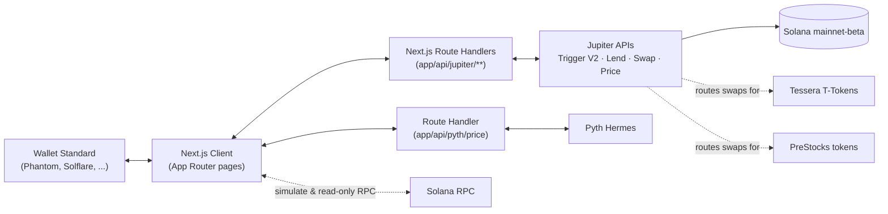

# StackNBorrow

**Stack stocks. Borrow against them. Never sell.**

Automate recurring stock buys on Solana, then borrow against your position instead of selling when you need cash — no custom smart contract, built entirely on [Jupiter's](https://jup.ag) existing infrastructure. Also stacks private-company exposure via [Tessera](https://tessera.pe) and [PreStocks](https://prestocks.com), and cross-checks on-chain prices against real market data via [Pyth Network](https://pyth.network).

[](./LICENSE)
[](https://nextjs.org)
[](https://solana.com)
[](https://dev.jup.ag)

---

## The problem

On-chain investing is usually all-or-nothing: you either hold your position or you sell it for liquidity. A trader who needs cash for a week ends up breaking a months-long buying streak just to cover it — and loses the position they were building.

**StackNBorrow** turns that into a false choice. Set up a recurring buy once, let it run on-chain automatically, and if you ever need liquidity, borrow against what you've accumulated instead of selling it.

## What it does

| Screen | Job |
|---|---|
| **`/home`** | An at-a-glance overview — balances, your top holdings, active-order count, and quick actions. The default landing page after connecting. |
| **`/buy`** | A one-time purchase, settled immediately via Jupiter Swap — no recurring schedule. |
| **`/setup`** | Create a recurring buy plan — pick an asset, amount, frequency, and number of rounds. Cancel active plans anytime. |
| **`/portfolio`** | The detailed ledger — full holdings, active orders, and order history. |
| **`/borrow`** | Deposit your position as collateral, borrow USDC against it, repay debt, or withdraw collateral — with a live loan-to-value and liquidation indicator. |
| **`/prestocks`** | A deliberately **isolated** recurring-buy flow for PreStocks pre-IPO tokens — see [Hackathon tracks](#hackathon-tracks) for why. |

All screens run against **live Solana mainnet** — real accounts, real transactions, real prices.

## Built on Jupiter — no custom program

StackNBorrow doesn't deploy or touch a single custom Solana program. Every balance-moving action is a real call into Jupiter's public infrastructure:

- **[Trigger API (V2)](https://dev.jup.ag/docs/trigger-api)** — creates and cancels on-chain recurring buy orders
- **[Lend API](https://dev.jup.ag/docs/lend)** — deposits collateral, borrows against it, repays debt, and withdraws collateral
- **[Swap API](https://dev.jup.ag/docs/swap-api)** — one-off manual buys
- **[Price API](https://dev.jup.ag/docs/price-api)** — live USD pricing for every asset, including a `stockData` field Jupiter attaches to tokenized-equity mints (implied company valuation) that the UI surfaces directly

Jupiter's infrastructure executes every scheduled buy on-chain natively — there is no custom scheduler, keeper, lending pool, or oracle in this codebase.

## Why Solana

The buy-then-borrow loop this app automates would take days and multiple institutions in traditional finance. On Solana it's two on-chain actions, sub-cent fees, and instant settlement — available 24/7, not just market hours.

## Hackathon tracks

StackNBorrow's core thesis — *stack exposure to an asset without selling it, borrow against it when you need cash* — extends naturally beyond public-market xStocks. Three sponsor tracks map directly onto that thesis, and each was verified live against the sponsor's actual API before being wired into the app (mints, routes, and prices below were confirmed via real requests, not assumed).

### Pyth Network — live market data

**What it does:** on `/home` and `/portfolio`, each xStock holding shows a peg-deviation line — how far the on-chain trading price (from Jupiter) has drifted from Pyth's live feed for the real underlying equity, e.g. *"vs. real TSLA: +0.18%"*.

**Why this fits:** it's the track's own suggested build (a "price-comparison surface"), and it's a direct extension of this app's premise — a peg-tracking tool for tokenized stocks is only trustworthy if you can independently verify the peg.

**How it's built:** `lib/pyth/` holds a small proxy layer mirroring the existing Jupiter proxy pattern — `server.ts` wraps Hermes with the API key (server-only), `feeds.ts` maps each xStock mint to a real Pyth feed ID, `usePythPrices.ts` is a client hook, and `app/api/pyth/price/route.ts` is the Route Handler in between. Feed IDs were found live via Hermes' `/v2/price_feeds` search endpoint, not guessed.

**Honest about entitlement:** Pyth API keys are scoped per-feed. This project's grant covers `Equity.US.{VOO,TSLA,QQQ}/USD` — **NVDAx has no comparison** (no NVDA feed in the grant) and **SPYx is compared against VOO** (Vanguard's S&P 500 ETF) rather than SPY, since SPY itself isn't in the grant but both track the same index. If a feed call ever fails, the UI hides the line and shows a muted note — it never fabricates a number.

### Tessera — pre-IPO stocks, same thesis

**What it does:** T-OpenAI and T-Kalshi are fully first-class stackable assets — available for recurring buys on `/setup`, one-time buys on `/buy`, tracked on `/portfolio` and `/home` right alongside the xStocks. Each shows Jupiter's own `stockData.mcap` as an "Implied val" line.

**Why this fits:** identical product thesis, applied to private markets instead of public equities — "stack pre-IPO exposure without selling."

**How it's built:** confirmed both mints route live through Jupiter (`/swap/v1/quote`, Meteora DLMM pools) and are already priced by Jupiter's own `/price/v3` — including that first-class `stockData: {id: "tessera", price, mcap}` field — before adding anything. Not Jupiter Lend collateral, so `XStockAsset` gained a `lendEligible` flag and the shared `AssetSelector` component takes an explicit `assets` list per page: `/borrow`'s picker only ever shows the 4 real Lend-eligible xStocks.

| Token | Mint |
|---|---|
| T-OpenAI | `oPAiAikWTaFj9RYoRFD35ccfwhnMcB3ThgBZRHSkjTZ` |
| T-Kalshi | `TKLSidmLVt3cqGaaodG8tyRzoANfQwoh67AccjmubeZ` |

### PreStocks — isolated by design

**What it does:** `/prestocks` is a self-contained recurring-buy flow for two PreStocks tokens (Anthropic, Anduril) — its own asset picker, its own "active plans" list, filtered so it never shows a plan for any other provider's token.

**Why isolated, not merged:** PreStocks' bounty rules disqualify a submission that also integrates a non-PreStocks pre-IPO token — and this app already integrates Tessera's. Rather than risk the whole submission on an ambiguous eligibility read, PreStocks assets live in their own `PRESTOCKS_ASSETS` list (`lib/jupiter/assets.ts`), never merged into the `SUPPORTED_ASSETS` array that powers `/setup`, `/buy`, `/portfolio`, and `/borrow`. `/prestocks` can be demoed and judged entirely on its own.

**How it's built:** mint addresses were pulled live from PreStocks' own products page (the real Solscan links embedded in the rendered page, not guessed), then each was confirmed swap-routable through Jupiter before being wired in.

| Token | Mint |
|---|---|
| Anthropic | `Pren1FvFX6J3E4kXhJuCiAD5aDmGEb7qJRncwA8Lkhw` |
| Anduril | `PresTj4Yc2bAR197Er7wz4UUKSfqt6FryBEdAriBoQB` |

## Supported assets

### xStocks (public equities — recurring buy, one-time buy, and borrow)

Four [xStocks](https://xstocks.com) — chosen because they're the ones currently listed as [Jupiter Lend](https://dev.jup.ag/docs/lend) collateral, verified directly against Jupiter's live API rather than assumed:

| Ticker | Underlying | Max LTV | Liquidation threshold |
|---|---|---|---|
| **NVDAx** | NVIDIA | 65% | 75% |
| **SPYx** | S&P 500 | 75% | 85% |
| **QQQx** | Nasdaq | 75% | 85% |
| **TSLAx** | Tesla | 65% | 75% |

These numbers are never hardcoded in the app — every LTV, liquidation threshold, and price shown is fetched live from Jupiter at request time. None of these are Jupiter Lend collateral by coincidence — `/borrow`'s picker is filtered to exactly this set via each asset's `lendEligible` flag.

### Tessera & PreStocks (private companies — recurring buy and one-time buy only)

Not Lend collateral, and PreStocks assets are additionally kept out of every shared list — see [Hackathon tracks](#hackathon-tracks) above for the mint addresses and the isolation rationale.

## Engineering highlights

- **Simulate before sign.** Every transaction — deposit, order creation, cancellation, borrow, swap — runs through `simulateTransaction` against live mainnet state before the wallet is ever asked to sign. Bad transactions fail for free; the user never wastes a signature or a fee on something that was going to fail anyway.
- **No silent hangs.** Every network call — RPC, Jupiter API, wallet signature request — has an explicit timeout. A slow or unresponsive endpoint surfaces a real error instead of freezing the UI indefinitely.
- **Real errors, not generic ones.** API failures are passed through to the UI verbatim wherever practical, instead of being flattened into "something went wrong." The Pyth peg-comparison feature follows the same rule: if the feed call fails, it disappears rather than showing a fabricated number.
- **Provider isolation by design.** PreStocks assets are structurally incapable of appearing anywhere Tessera assets do — enforced by keeping them in a separate constant and a separate page, not by convention.
- **Demo Mode.** A toggle on `/setup` and `/prestocks` shortens the recurring interval options (1 / 2 / 5 minutes) so a live demo doesn't require waiting days between visible buys — real orders, just on a faster clock.
- **Wallet Standard, not a custom connector.** Wallet connection auto-discovers any installed [Wallet Standard](https://github.com/wallet-standard/wallet-standard) wallet (Phantom, Solflare, etc.) — no bespoke per-wallet integration code.
- **Full borrow lifecycle, not just borrowing.** `/borrow` covers the whole position lifecycle — deposit, borrow, repay, and withdraw — through tabs on a single page, all routed through the same Lend `/operate` endpoint with signed base-units amounts (positive = supply/borrow, negative = repay/withdraw, a sentinel value for "repay all" / "withdraw all").
- **AI-guided onboarding.** A site-wide GuideAI assistant widget answers questions and can walk a first-time user through the stack → borrow flow without leaving the page.

## Design & motion

A Lenis-driven smooth scroll (synced to GSAP's ticker so `ScrollTrigger` stays in sync) underlies the whole app. The landing page gets one orchestrated hero load sequence — a per-line masked text reveal (GSAP SplitText), then the floating cards stagger in — followed by a single consistent scroll-reveal language across every section, rather than a different animation gimmick per component. The dashboard's motion is deliberately more restrained: a quick page-mount transition, a sliding active-nav indicator, numbers that count up as they load, and rows that stagger in once on first data load — confirmatory motion for a finance app, not decoration. Everything is wrapped in `prefers-reduced-motion` checks.

The dashboard sidebar collapses into a hamburger-triggered slide-in drawer below the `lg` breakpoint, rather than stacking all nav items above the page content on mobile.

## Tech stack

| Layer | Choice |
|---|---|
| Framework | [Next.js 16](https://nextjs.org) (App Router), TypeScript, Tailwind CSS |
| Motion | [GSAP](https://gsap.com) (ScrollTrigger, SplitText) + [Lenis](https://lenis.darkroom.engineering) smooth scroll |
| Wallet | [`@solana/client`](https://www.npmjs.com/package/@solana/client) + [`@solana/react-hooks`](https://www.npmjs.com/package/@solana/react-hooks) (Wallet Standard) |
| Solana SDK | `@solana/kit`, `@solana/web3.js`, `@solana/compat` |
| Backend | Next.js Route Handlers only — no separate backend service |
| Chain | Solana mainnet-beta |
| Trading / lending infra | Jupiter Trigger V2, Lend, Swap, Price APIs |
| Market data | [Pyth Network](https://pyth.network) (Hermes) |
| Pre-IPO providers | [Tessera](https://tessera.pe), [PreStocks](https://prestocks.com) |
| In-app assistant | GuideAI — AI-guided onboarding & support widget, embedded site-wide |

## Architecture



Both the Jupiter API key and the Pyth API key live only in Route Handlers — neither is ever shipped to the client bundle. The client signs transactions locally via the connected wallet; Route Handlers never see a private key. Tessera and PreStocks tokens aren't separate integrations at the trading layer — they're ordinary SPL mints that Jupiter already routes and prices, added to the app's asset lists after confirming that live.

## Getting started

### Prerequisites

- Node.js 20+
- A [Jupiter API key](https://developers.jup.ag/portal) (free tier works for development)
- A [Pyth API key](https://pyth.network) (only needed for the peg-comparison feature on `/home` and `/portfolio` — the rest of the app works without it)
- A dedicated Solana RPC endpoint — Helius, Triton, or QuickNode (the public RPC will rate-limit you)
- A Wallet Standard wallet extension (Phantom, Solflare, etc.) with a small amount of real SOL + USDC, since this runs on mainnet

### Setup

```bash
git clone https://github.com/sogobanwo/StackNBorrow.git
cd StackNBorrow
npm install
cp .env.local.example .env.local
```

Fill in `.env.local`:

```bash
# Server-only — never exposed to the client
JUPITER_API_KEY=

# Server-only — powers the /portfolio and /home peg-comparison feature
PYTH_API_KEY=

# Public — a dedicated RPC endpoint (Helius/Triton/QuickNode)
NEXT_PUBLIC_SOLANA_RPC_URL=
```

Then run it:

```bash
npm run dev
```

Open [http://localhost:3000](http://localhost:3000), connect a wallet, and go.

## Project structure

```
app/
├── (app)/                  # Dashboard route group: /home, /buy, /setup, /portfolio, /borrow, /prestocks
├── api/
│   ├── jupiter/             # Route Handlers proxying Trigger V2, Lend, Swap, Price
│   └── pyth/                # Route Handler proxying Pyth Hermes
├── components/
│   ├── dashboard/           # Shared dashboard shell + feature panels per screen
│   └── wallet/              # Wallet Standard connection modal
└── providers.tsx            # Solana client, wallet modal, and smooth-scroll providers

lib/
├── jupiter/                 # Typed API client, hooks (auth, portfolio, borrow data), asset lists
├── pyth/                    # Feed-ID map, server proxy, client hook for live equity prices
├── motion/                  # Shared GSAP/Lenis setup and reveal/count-up/row-stagger hooks
├── solana/                  # Read-only RPC helpers, transaction simulation
├── wallet/                  # useSigner() — one signing interface for every wallet
└── timeout.ts                # Shared timeout wrapper used across every network call
```

## Roadmap

What's deliberately out of scope for this submission, and would be next:

- Broader xStock support on `/setup` beyond the 4 Lend-eligible tickers
- Wider Pyth entitlement (NVDA, and SPY itself rather than the VOO proxy) once available
- Historical LTV/health charting

## License

MIT — see [LICENSE](./LICENSE).

## Acknowledgments

Built entirely on [Jupiter's](https://jup.ag) Trigger, Lend, Swap, and Price APIs, the [Solana](https://solana.com) [Wallet Standard](https://github.com/wallet-standard/wallet-standard), live market data from [Pyth Network](https://pyth.network), and pre-IPO token infrastructure from [Tessera](https://tessera.pe) and [PreStocks](https://prestocks.com).
