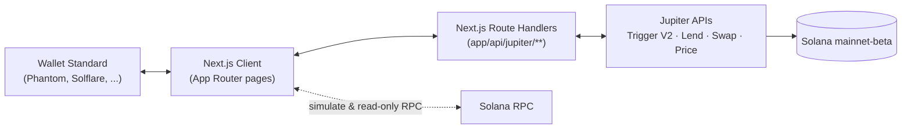

# StackNBorrow

**Stack stocks. Borrow against them. Never sell.**

Automate recurring stock buys on Solana, then borrow against your position instead of selling when you need cash — no custom smart contract, built entirely on [Jupiter's](https://jup.ag) existing infrastructure.

[](./LICENSE)
[](https://nextjs.org)
[](https://solana.com)
[](https://dev.jup.ag)

---

## The problem

On-chain investing is usually all-or-nothing: you either hold your position or you sell it for liquidity. A trader who needs cash for a week ends up breaking a months-long buying streak just to cover it — and loses the position they were building.

**StackNBorrow** turns that into a false choice. Set up a recurring buy once, let it run on-chain automatically, and if you ever need liquidity, borrow against what you've accumulated instead of selling it.

## What it does

| Screen | Job |
|---|---|
| **`/setup`** | Create a recurring buy plan — pick an asset, amount, frequency, and number of rounds. Cancel active plans anytime. |
| **`/portfolio`** | See your real holdings, active/past orders, a streak counter, and a manual "Buy Now" swap. |
| **`/borrow`** | Deposit your position as collateral and borrow USDC against it, with a live loan-to-value and liquidation indicator. |

All three run against **live Solana mainnet** — real accounts, real transactions, real prices.

## Built on Jupiter — no custom program

StackNBorrow doesn't deploy or touch a single custom Solana program. Every balance-moving action is a real call into Jupiter's public infrastructure:

- **[Trigger API (V2)](https://dev.jup.ag/docs/trigger-api)** — creates and cancels on-chain recurring buy orders
- **[Lend API](https://dev.jup.ag/docs/lend)** — deposits collateral and borrows against it
- **[Swap API](https://dev.jup.ag/docs/swap-api)** — one-off manual buys
- **[Price API](https://dev.jup.ag/docs/price-api)** — live USD pricing for the portfolio view

Jupiter's infrastructure executes every scheduled buy on-chain natively — there is no custom scheduler, keeper, lending pool, or oracle in this codebase.

## Why Solana

The buy-then-borrow loop this app automates would take days and multiple institutions in traditional finance. On Solana it's two on-chain actions, sub-cent fees, and instant settlement — available 24/7, not just market hours.

## Supported assets

Four [xStocks](https://xstocks.com) — chosen because they're the ones currently listed as [Jupiter Lend](https://dev.jup.ag/docs/lend) collateral, verified directly against Jupiter's live API rather than assumed:

| Ticker | Underlying | Max LTV | Liquidation threshold |
|---|---|---|---|
| **NVDAx** | NVIDIA | 65% | 75% |
| **SPYx** | S&P 500 | 75% | 85% |
| **QQQx** | Nasdaq | 75% | 85% |
| **TSLAx** | Tesla | 65% | 75% |

These numbers are never hardcoded in the app — every LTV, liquidation threshold, and price shown is fetched live from Jupiter at request time.

## Engineering highlights

- **Simulate before sign.** Every transaction — deposit, order creation, cancellation, borrow, swap — runs through `simulateTransaction` against live mainnet state before the wallet is ever asked to sign. Bad transactions fail for free; the user never wastes a signature or a fee on something that was going to fail anyway.
- **No silent hangs.** Every network call — RPC, Jupiter API, wallet signature request — has an explicit timeout. A slow or unresponsive endpoint surfaces a real error instead of freezing the UI indefinitely.
- **Real errors, not generic ones.** API failures are passed through to the UI verbatim wherever practical, instead of being flattened into "something went wrong."
- **Demo Mode.** A toggle on `/setup` shortens the recurring interval options (1 / 2 / 5 minutes) so a live demo doesn't require waiting days between visible buys — real orders, just on a faster clock.
- **Wallet Standard, not a custom connector.** Wallet connection auto-discovers any installed [Wallet Standard](https://github.com/wallet-standard/wallet-standard) wallet (Phantom, Solflare, etc.) — no bespoke per-wallet integration code.

## Tech stack

| Layer | Choice |
|---|---|
| Framework | [Next.js 16](https://nextjs.org) (App Router), TypeScript, Tailwind CSS |
| Wallet | [`@solana/client`](https://www.npmjs.com/package/@solana/client) + [`@solana/react-hooks`](https://www.npmjs.com/package/@solana/react-hooks) (Wallet Standard) |
| Solana SDK | `@solana/kit`, `@solana/web3.js`, `@solana/compat` |
| Backend | Next.js Route Handlers only — no separate backend service |
| Chain | Solana mainnet-beta |
| Trading / lending infra | Jupiter Trigger V2, Lend, Swap, Price APIs |

## Architecture



The Jupiter API key lives only in Route Handlers — it is never shipped to the client bundle. The client signs transactions locally via the connected wallet; Route Handlers never see a private key.

## Getting started

### Prerequisites

- Node.js 20+
- A [Jupiter API key](https://developers.jup.ag/portal) (free tier works for development)
- A dedicated Solana RPC endpoint — Helius, Triton, or QuickNode (the public RPC will rate-limit you)
- A Wallet Standard wallet extension (Phantom, Solflare, etc.) with a small amount of real SOL + USDC, since this runs on mainnet

### Setup

```bash
git clone https://github.com/sogobanwo/StackNBorrow.git
cd StackNBorrow
npm install
cp .env.local.example .env.local
```

Fill in `.env.local`:

```bash
# Server-only — never exposed to the client
JUPITER_API_KEY=

# Public — a dedicated RPC endpoint (Helius/Triton/QuickNode)
NEXT_PUBLIC_SOLANA_RPC_URL=
```

Then run it:

```bash
npm run dev
```

Open [http://localhost:3000](http://localhost:3000), connect a wallet, and go.

## Project structure

```
app/
├── (app)/                  # Dashboard route group: /setup, /portfolio, /borrow
├── api/jupiter/            # Route Handlers proxying Trigger V2, Lend, Swap, Price
├── components/
│   ├── dashboard/           # Shared dashboard shell + feature panels per screen
│   └── wallet/              # Wallet Standard connection modal
└── providers.tsx            # Solana client + wallet modal providers

lib/
├── jupiter/                 # Typed API client, hooks (auth, portfolio, borrow data)
├── solana/                  # Read-only RPC helpers, transaction simulation
├── wallet/                  # useSigner() — one signing interface for every wallet
└── timeout.ts                # Shared timeout wrapper used across every network call
```

## Roadmap

What's deliberately out of scope for this submission, and would be next:

- Repay debt / withdraw collateral (the Lend `/operate` endpoint already supports both — not wired into the UI yet)
- Broader xStock support on `/setup` beyond the 4 Lend-eligible tickers
- Historical LTV/health charting

## License

MIT — see [LICENSE](./LICENSE).

## Acknowledgments

Built entirely on [Jupiter's](https://jup.ag) Trigger, Lend, Swap, and Price APIs, and the [Solana](https://solana.com) [Wallet Standard](https://github.com/wallet-standard/wallet-standard).
